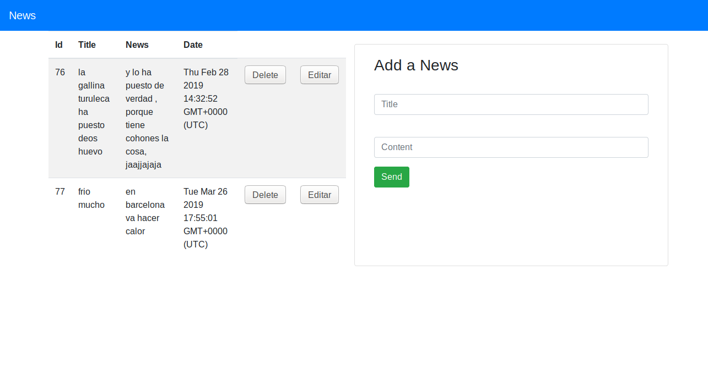

# crud-node-mysql-1
CRUD CON   NODE  Y MYSQL
inicializar proyecto:

npm init --yes

Dependencias:

npm i express ejs mysql body-parser

Hay que crear una base de datos vacia llamada: "news_portal_nodejs"   y  hacer una importacion con el archivo sql que se adjunta. 
 
